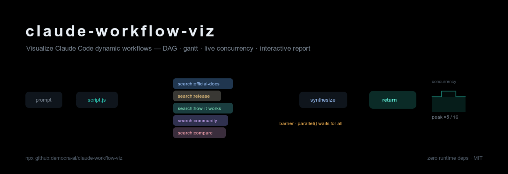
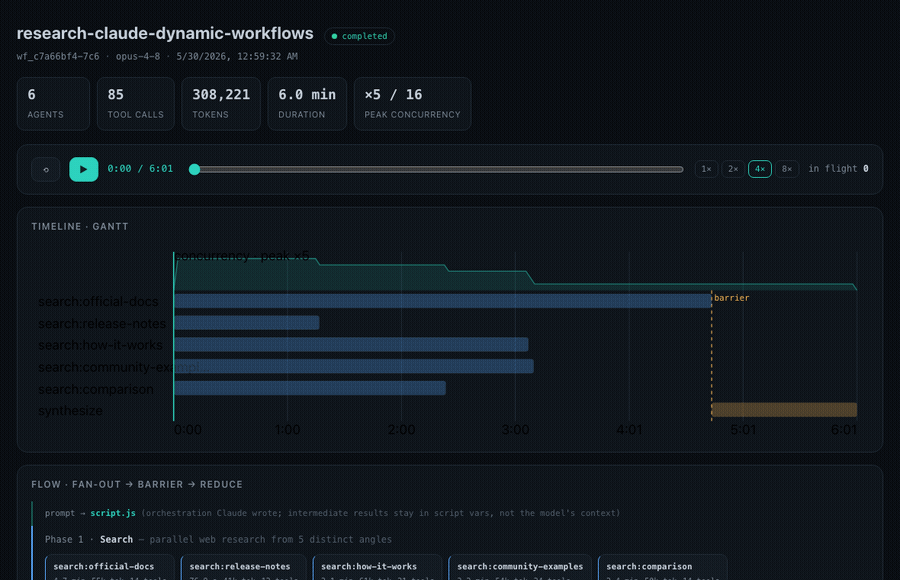
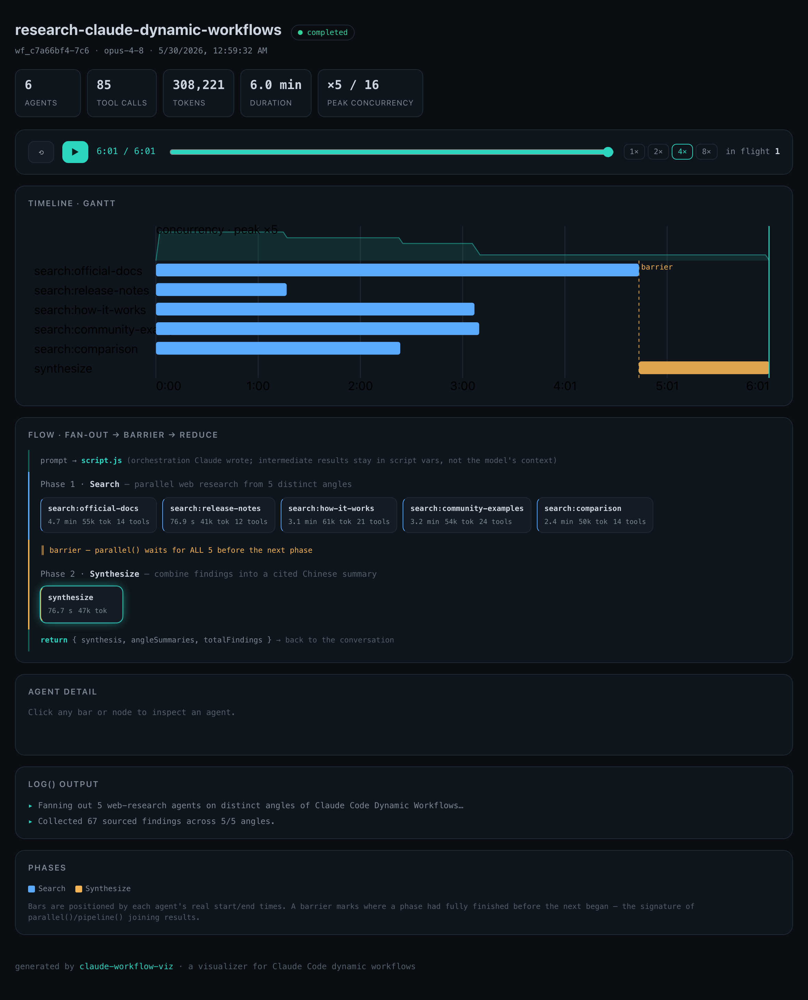
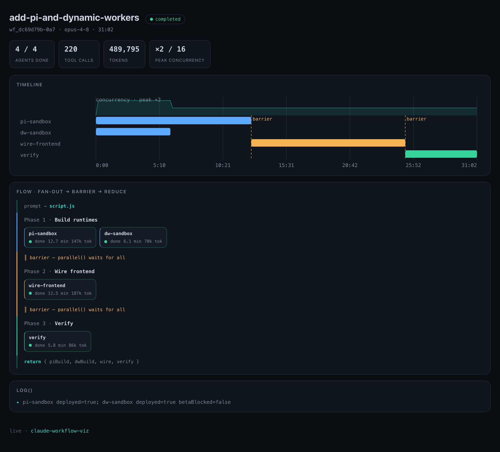

<p align="center">
  
</p>

<h1 align="center">claude-workflow-viz</h1>

<p align="center">
  <strong>See your Claude Code dynamic workflows.</strong> A live dashboard that auto-opens when a workflow starts,<br/>
  plus a terminal view and a self-contained interactive HTML report — DAG · gantt · live concurrency.
</p>

<p align="center">
  <a href="https://github.com/democra-ai/claude-workflow-viz/actions/workflows/ci.yml"></a>
  <a href="https://nodejs.org"></a>
  <a href="./LICENSE"></a>
  <a href="./package.json"></a>
  <a href="https://democra-ai.github.io/claude-workflow-viz/"></a>
</p>

<p align="center">
  <a href="https://democra-ai.github.io/claude-workflow-viz/"><b>▶ Live demo</b></a> ·
  <a href="#auto-launch-as-a-claude-code-plugin"><b>Plugin</b></a> ·
  <a href="#commands"><b>Commands</b></a> ·
  <a href="#how-it-works"><b>How it works</b></a>
</p>

---

### The replay — watch a finished run play back from `0:00` to done

<p align="center">
  
</p>

<table>
<tr>
<td width="50%" valign="top">

**Interactive HTML report** &nbsp;·&nbsp; `wfviz export`



</td>
<td width="50%" valign="top">

**Live dashboard** &nbsp;·&nbsp; auto-opens via the plugin



</td>
</tr>
</table>

---

Claude Code's [dynamic workflows](https://code.claude.com/docs/en/workflows) fan a single task out across dozens — sometimes hundreds — of subagents. The built-in `/workflows` view is great while you're in the session, but once a run finishes the rich structure (which agents ran in parallel, where the `parallel()` barriers were, how long each took, how many tokens they burned) is locked away in JSON on disk.

**`wfviz` reads that JSON and brings the run back to life** — in the terminal, or as a polished standalone HTML page you can share.

It's a zero-runtime-dependency CLI. Point it at any run and it reconstructs the **fan-out → barrier → reduce** shape from the real timings.

```
  research-claude-dynamic-workflows
  ✔ completed  ·  wf_c7a66bf4-7c6  ·  1h ago  ·  opus-4-8

  6 agents   85 tool calls   308,221 tokens   6.0 min   peak ×5/16

  ▸ Fanning out 5 web-research agents on distinct angles of Claude Code Dynamic Workflows…
  ▸ Collected 67 sourced findings across 5/5 angles.

  Phase 1 · Search              ██████████████████████████████······· 4.7 min  ⑃ 5-wide
    ✔ search:official-docs      ██████████████████████████████·······  4.7 min · 55k tok · 14t
    ✔ search:release-notes      ████████·····························   76.9 s · 41k tok · 12t
    ✔ search:how-it-works       ████████████████████·················  3.1 min · 61k tok · 21t
    ✔ search:community-examples ████████████████████·················  3.2 min · 54k tok · 24t
    ✔ search:comparison         ███████████████······················  2.4 min · 50k tok · 14t
                                ║ barrier — next phase waits for all ║

  Phase 2 · Synthesize          ·····························████████ 76.7 s
    ✔ synthesize                ·····························████████   76.7 s · 47k tok

  timeline                      0:00 ├───────────────────────────────────┤ 6:01

  → returns { synthesis, angleSummaries, totalFindings }
```

---

## Auto-launch as a Claude Code plugin

The best way to use it: install the plugin and a live visualization **opens by itself the moment a workflow starts** — no command to remember.

```
/plugin marketplace add democra-ai/claude-workflow-viz
/plugin install claude-workflow-viz@democra-ai
```

That's it. The plugin registers a `PreToolUse` hook on the `Workflow` tool; when Claude Code begins any dynamic workflow, the hook starts a tiny local server and opens a live dashboard in your browser that **follows the run** — agents light up as they queue → run → finish, with the gantt, the `parallel()` barriers, and live concurrency all updating in real time. Re-runs reuse the same server and tab.

- Hooks load automatically on enable — **no `settings.json` editing**.
- **Nothing builds on install** — the plugin ships a prebuilt, dependency-free `bin/wfviz.mjs` (you just need Node ≥ 18 on PATH).
- Change the port with `WFVIZ_PORT` (default `7682`). Manage or remove it any time via `/plugin`.

## Install (CLI)

No npm publish required — run it straight from GitHub:

```bash
npx github:democra-ai/claude-workflow-viz list
```

Or clone and link for repeated use:

```bash
git clone https://github.com/democra-ai/claude-workflow-viz
cd claude-workflow-viz
npm install        # installs dev deps and builds (via the prepare hook)
npm link           # exposes `wfviz` on your PATH
wfviz list
```

Requires **Node ≥ 18**. Works on macOS, Linux, and Windows.

---

## Commands

```
wfviz <command> [ref] [options]
```

`ref` is a run id (`wf_ab12cd34`), the literal `latest`, or a path to a `wf_<id>.json`. It defaults to `latest`.

| Command | What it does |
| --- | --- |
| `wfviz list` | List discovered runs, newest first |
| `wfviz show [ref]` | Render a run in the terminal |
| `wfviz watch [ref]` | Live terminal view — redraws until the run finishes |
| `wfviz live` | Start a live **web** dashboard (auto-opens; this is what the plugin launches) |
| `wfviz export [ref] -o report.html` | Write a self-contained interactive HTML report |

### List your runs

```bash
$ wfviz list

  6 runs

  completed   visualize-dynamic-workflow         wf_75e4612c-718    6 agents   17.5 min  1h ago
  completed   research-claude-dynamic-workflows  wf_c7a66bf4-7c6    6 agents    6.0 min  1h ago
  completed   review-candyshop-model-picker      wf_48c81ec6-687   17 agents   23.3 min  7h ago
  completed   candy-shop-full-verification       wf_41961ca6-1d1   30 agents   41.7 min  8h ago
  …
```

### Watch a run live

```bash
wfviz watch            # follow the most recent run; redraws every second until it ends
```

`watch` is resilient to the run file being rewritten mid-flight and stops automatically once the workflow reaches a terminal status. Press `Ctrl-C` to detach.

### Export an interactive HTML report

```bash
wfviz export latest -o run.html --open
```

The report is a **single self-contained file** — no external requests, no build step — so it opens straight from `file://` and is safe to email or commit. It includes:

- a **gantt timeline** with each agent's real start/end, a concurrency curve, and barrier markers;
- a **fan-out → barrier → reduce flow** with one node per agent, grouped by phase;
- a **replay scrubber** (play / pause / scrub at 1–8×) that lights up agents by their real timings;
- **per-agent drill-down** — duration, tokens, tool calls, retries, last tool, prompt/result preview.

▶ **Try it:** open [`examples/example-report.html`](./examples/example-report.html) (a completed run) or [`examples/example-running.html`](./examples/example-running.html) (one still in flight) in a browser.

### Options

```
--here              Only runs from the current directory's project
--project <slug>    Only runs from a specific project slug
--limit <n>         Limit number of runs (list)
--json              Machine-readable output (list)
-o, --out <file>    Output path (export)
--open              Open the report after writing (export)
--cap <n>           Concurrency-cap reference to display (default: 16)
--interval <ms>     Poll interval for watch (default: 1000)
--width <n>         Terminal width override (show, watch)
--no-color          Disable ANSI colour
```

---

## How it works

Claude Code records every dynamic-workflow run on disk under your config directory:

```
~/.claude/projects/<project-slug>/<session-id>/
├── workflows/
│   ├── wf_<id>.json                    ← run descriptor (status, phases, per-agent progress, totals)
│   └── scripts/<name>-wf_<id>.js       ← the orchestration script Claude wrote
└── subagents/workflows/wf_<id>/
    ├── journal.jsonl                   ← started/result events (used for live watch)
    └── agent-<id>.jsonl                ← each subagent's full transcript
```

`wfviz` discovers every `wf_<id>.json` (override the root with `CLAUDE_CONFIG_DIR`), normalizes it into a stable model, and derives the things the raw file doesn't state outright:

- **Parallelism** — agents whose execution windows overlap are packed into lanes, recovering the fan-out width.
- **Barriers** — when a phase began only *after* the previous phase had fully finished, that's the signature of a `parallel()`/`pipeline()` join, and it's marked as a barrier.
- **Concurrency** — in-flight agent count over time, with the peak compared against Claude Code's default cap of 16.

Everything is positioned from each agent's real `startedAt` / `durationMs`, so the picture matches what actually happened.

---

## Programmatic API

```ts
import { discoverRuns, parseRunFile, renderRun, renderHtml } from "claude-workflow-viz";

const [latest] = discoverRuns();           // newest run first
const run = parseRunFile(latest.sourcePath);

console.log(renderRun(run, { color: true })); // terminal string
const html = renderHtml(run);                  // self-contained HTML
```

The parser is deliberately defensive — every field is optional and validated, so a change to the (research-preview) on-disk format degrades gracefully instead of throwing.

---

## Development

```bash
npm install        # install dev deps + build
npm run build      # tsc -> dist/
npm run typecheck  # type-check only
npm test           # build + run the node:test suite
```

```
src/
├── discover.ts        find runs on disk
├── parse.ts           normalize a wf_<id>.json into a WorkflowRun
├── model.ts           concurrency, barriers, lane packing
├── format.ts          ANSI colour, durations, bar primitives
├── render-terminal.ts terminal visualization
├── render-html.ts     self-contained interactive HTML
├── watch.ts           live polling loop
└── cli.ts             command-line interface
```

The test suite covers parsing (real + in-progress + malformed fixtures), the derived metrics, both renderers, and discovery against a temp project tree.

---

## Compatibility & disclaimer

Dynamic workflows are a Claude Code **research preview**, and the on-disk format may change between releases. `wfviz` treats the format as best-effort and is built to fail soft. It is an independent, community project and is **not affiliated with or endorsed by Anthropic**. It reads local files only — nothing is uploaded anywhere.

## License

[MIT](./LICENSE) © democra.ai
